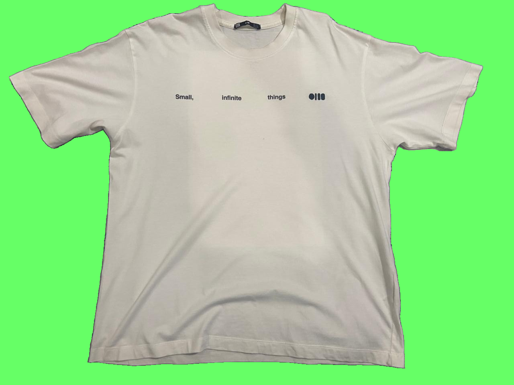
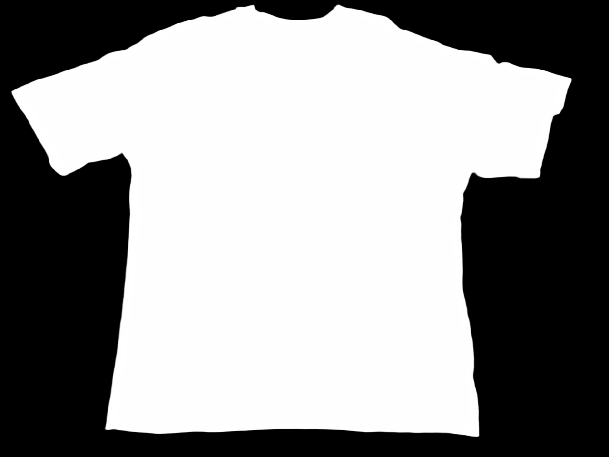
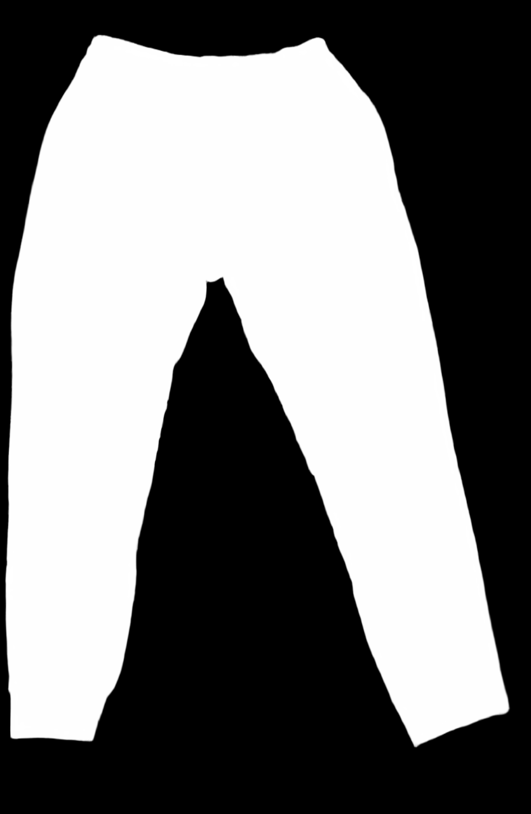

# Wardrooob: AI Wardrobe Tracker

Welcome to **Wardrooob**, an intelligent AI-driven Wardrobe Tracker. This repository contains the code, data, and models for building a digitalized wardrobe ecosystem.

---

## 🌟 The Big Idea: AI Wardrobe Tracker

The core vision of **Wardrooob** is to redefine how we interact with our wardrobes by building an intelligent personal assistant that helps users digitalize, measure, organize, and interact with their clothing collection. 

Instead of manually measuring garments or struggling to remember how a specific item fits, the AI Wardrobe Tracker uses advanced computer vision and machine learning to:
*   **Automatic Digitalization:** Simply snap a picture of your clothes flat on a surface, and the AI categorizes and logs it automatically.
*   **Touchless Measurement:** Extracts precise garment dimensions (like chest width, shoulder width, sleeve length, waist width, and inseam) directly from a photo.
*   **Personalized Analytics:** Offers outfit recommendations, wardrobe statistics, and size matching across different retail brands.

---

## 🚀 Stage 1: Core Python Logic & Machine Learning Pipeline

In **Stage 1**, we have built the core python logic, computer vision pipeline, and validation tools.

### 1. Unified Computer Vision Pipeline (`run_garmentiq.py`)
At this stage, the project integrates the **GarmentIQ** framework to orchestrate:
*   **Garment Classification:** A fine-tuned **TinyViT** transformer model that automatically identifies the clothing type (e.g., shirt, trousers).
*   **Garment Segmentation:** A high-precision **BiRefNet** model that isolates the garment, creating a clean segmentation mask and replacing the original background with a solid green screen (chromakey style).
*   **Landmark Detection:** An **HRNet** (PoseHighResolutionNet) keypoint detection model that pinpoints functional measurement vertices on the garment (collar corners, shoulders, waist edges, cuffs).
*   **Measurement Extraction:** Computes exact pixel distances between corresponding landmarks to determine size proportions.

### 2. Accuracy Evaluator (`evaluate_accuracy.py`)
Because pixels do not directly translate to real-world dimensions, the evaluator:
*   Calibrates the system using a known reference dimension (e.g., the front length of a shirt in inches) from a ground truth JSON file.
*   Computes a scaling factor (`inches/pixel`) and translates all other pixel distances into physical measurements.
*   Outputs absolute error and percentage error relative to actual manual measurements.

---

## 📸 Visual Walkthrough (Stage 1 Showcase)

Here is a visual demonstration of the unified pipeline executing on sample garments:

### 1. Input Images
These are the raw, unedited photographs of garments laid flat:

| Shirt | Trousers |
| :---: | :------: |
|  |  |

### 2. Isolated Garments (Background Removed)
The background segmentation model extracts the clothes and superimposes them onto a green screen background:

| Shirt Isolated | Trousers Isolated |
| :---: | :------: |
|  |  |

### 3. Segmentation Masks
Binary masks representing the isolated garment shape:

| Shirt Mask | Trousers Mask |
| :---: | :------: |
|  |  |

### 4. Landmark Measurement Overlays
Visualizes the detected landmarks and measurement trajectories calculated by HRNet:

| Shirt Measurements | Trousers Measurements |
| :---: | :------: |
|  |  |

---

## 🛠️ Local Installation & Setup

Since the model weights are not hosted/deployed directly in the cloud, you must set up the project locally. Follow these steps:

### 1. Prerequisites
Ensure you have Python 3.11+ installed.

### 2. Set Up Virtual Environment & Dependencies
Clone the repository, navigate to the `stage1` directory, and set up your virtual environment:

```powershell
cd stage1
python -m venv venv
.\venv\Scripts\activate
pip install -r requirements.txt
```
*(Ensure PyTorch with GPU support is configured if you wish to run the models on CUDA).*

### 3. Download the Model Weights
Because these models are large and not stored in git, download them from Hugging Face and place them in the correct directories:

Create the folder structure inside `stage1`:
```
stage1/
└── models/
    ├── birefnet/
    │   └── model.safetensors
    ├── hrnet.pth
    └── tiny_vit_inditex_finetuned.pt
```

#### Download Links:
*   **TinyViT Model (Garment Classification):**  
    Download [tiny_vit_inditex_finetuned.pt](https://huggingface.co/lygitdata/garmentiq/resolve/main/tiny_vit_inditex_finetuned.pt) and place it in `stage1/models/`.
*   **HRNet Model (Landmark Detection):**  
    Download [hrnet.pth](https://huggingface.co/lygitdata/garmentiq/resolve/main/hrnet.pth) and place it in `stage1/models/`.
*   **BiRefNet Model (Segmentation):**  
    Download [model.safetensors](https://huggingface.co/lygitdata/BiRefNet_garmentiq_backup/resolve/main/model.safetensors) and place it in `stage1/models/birefnet/`.

---

## 🏃 Running the Scripts

Once installation and model configuration are complete, you can execute the following scripts using the PowerShell shortcuts located in `stage1/auto/`:

### 1. Run GarmentIQ Pipeline
Scans all images in `stage1/input_images`, classifies them, generates segmentation masks, and exports extracted pixel measurements to the `stage1/output/` folder.
```powershell
.\auto\run_garmentiq.ps1
```

### 2. Run Accuracy Evaluation
Compares the predicted pixel measurements against manual real-world measurement values logged in `stage1/actual_measurements/` to print accuracy stats.
```powershell
.\auto\run_evaluate_accuracy.ps1
```
