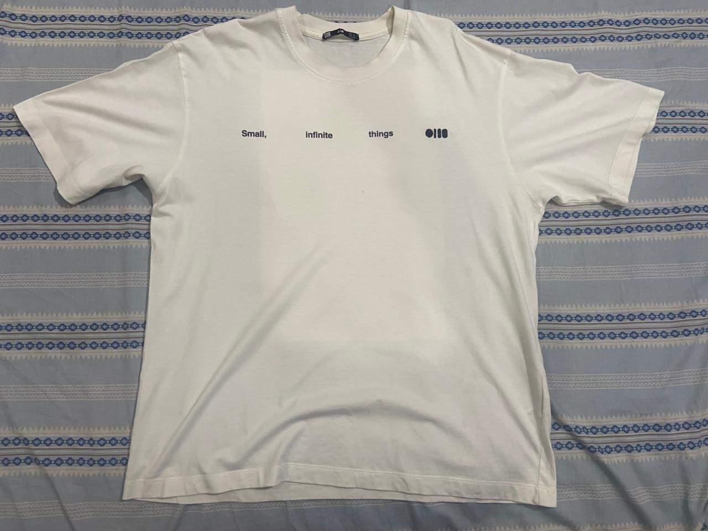
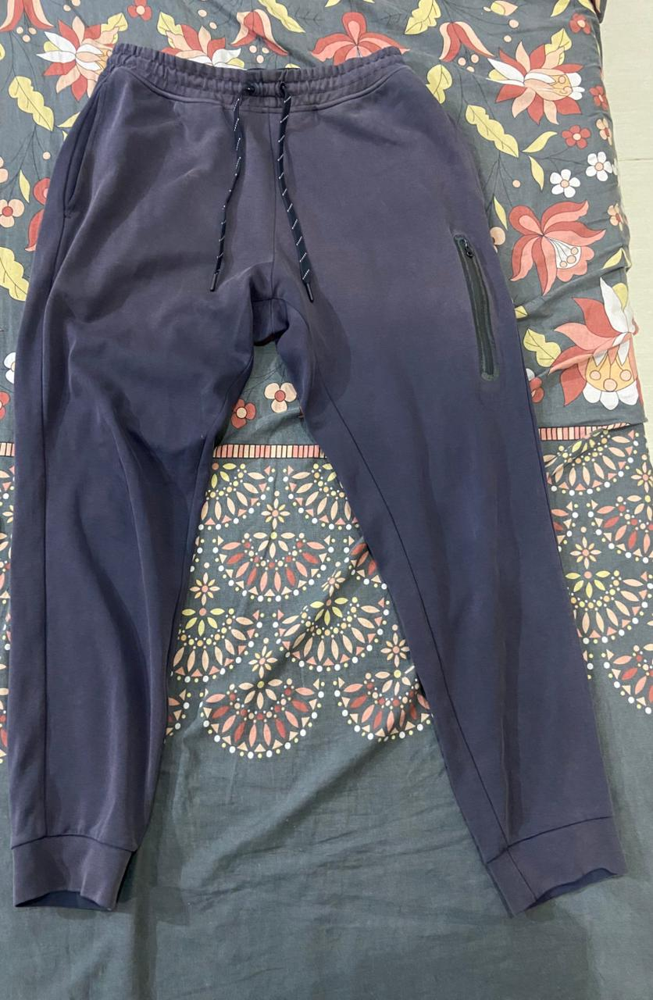
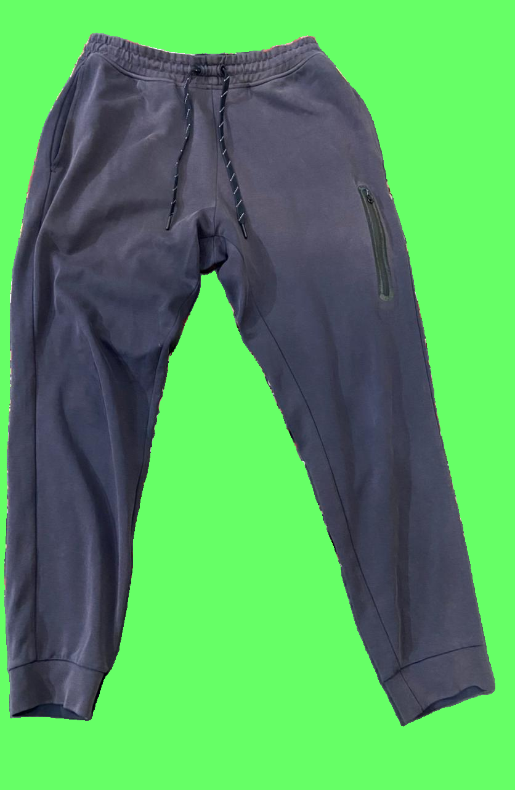

# Wardrooob: AI Wardrobe Tracker

Welcome to **Wardrooob**, an intelligent AI-driven Wardrobe Tracker. This repository contains the code, data, and models for building a digitalized wardrobe ecosystem.

---

## 🌟 The Big Idea: AI Wardrobe Tracker

The core vision of **Wardrooob** is to redefine how we interact with our wardrobes by building an intelligent personal assistant that helps users digitalize, measure, organize, and interact with their clothing collection. 

Instead of manually measuring garments or struggling to remember how a specific item fits, the AI Wardrobe Tracker uses advanced computer vision and machine learning to:
*   **Automatic Digitalization:** Simply snap a picture of your clothes flat on a surface, and the AI categorizes and logs it automatically.
*   **Touchless Measurement:** Extracts precise garment dimensions (like chest width, shoulder width, sleeve length, waist width, and inseam) directly from a photo.
*   **Personalized Analytics:** Offers outfit recommendations, wardrobe statistics, and size matching across different retail brands.

---

## 🚀 Repository Structure

The project is split into distinct stages:

```
clothes/
├── README.md                           <-- Main documentation
├── .gitignore                          <-- Root ignore file
│
├── stage1_clothes_measurement/          <-- Core Python clothing logic & measurements
│   ├── venv/                           <-- Dedicated virtual environment for clothes processing
│   ├── input_images/                   <-- Flat clothing photos
│   ├── output/                         <-- Extracted measurement JSONs, masks, overlays
│   ├── models/                         <-- Models specific to clothes (tiny_vit, birefnet, hrnet)
│   ├── scripts/                        <-- Python logic (run_garmentiq.py, evaluate_accuracy.py)
│   ├── tests/                          <-- Test suites
│   └── auto/                           <-- PowerShell run shortcuts
│
└── stage2_human_modeling/              <-- Human body shape estimator (SHAPY)
    ├── venv/                           <-- Dedicated virtual environment for SHAPY
    ├── regressor/                      <-- SHAPY regressor scripts
    ├── measurements/                   <-- Virtual measurement calculations
    ├── attributes/                     <-- S2A and A2S model files
    ├── samples/                        <-- Input person photos and output SMPL-X parameters / meshes
    ├── data/                           <-- SHAPY models and configuration weights
    ├── extract_keypoints.py            <-- Keypoint extractor (MediaPipe)
    └── run_pipeline.ps1                <-- SHAPY run script
```

---

## 👕 Stage 1: Clothes Measurement Pipeline

This stage focuses on the core Python logic for garment classification, background segmentation, and measurement extraction.

### 1. Unified Computer Vision Pipeline (`run_garmentiq.py`)
Integrates the **GarmentIQ** framework to orchestrate:
*   **Garment Classification:** A fine-tuned **TinyViT** transformer model that automatically identifies the clothing type (e.g., shirt, trousers).
*   **Garment Segmentation:** A high-precision **BiRefNet** model that isolates the garment, replacing the original background with a solid green screen (chromakey style).
*   **Landmark Detection:** An **HRNet** (PoseHighResolutionNet) keypoint detection model that pinpoints functional measurement vertices on the garment (collar corners, shoulders, waist edges, cuffs).
*   **Measurement Extraction:** Computes exact pixel distances between corresponding landmarks to determine size proportions.

### 2. Accuracy Evaluator (`evaluate_accuracy.py`)
Calibrates the system using a known reference dimension (e.g., the front length of a shirt in inches) from a ground truth JSON file to output absolute/percentage error relative to manual measurements.

### 📸 Stage 1 Showcase
Here is a visual demonstration of the unified pipeline executing on sample garments:

#### 1. Input Images
| Shirt | Trousers |
| :---: | :------: |
|  |  |

#### 2. Isolated Garments (Background Removed)
| Shirt Isolated | Trousers Isolated |
| :---: | :------: |
|  |  |

#### 3. Segmentation Masks
| Shirt Mask | Trousers Mask |
| :---: | :------: |
|  |  |

#### 4. Landmark Measurement Overlays
| Shirt Measurements | Trousers Measurements |
| :---: | :------: |
|  |  |

---

## 👤 Stage 2: Human Body Shape Modeling (SHAPY)

This stage leverages **SHAPY** (Accurate 3D Body Shape Regression using Metric and Semantic Attributes) to estimate the 3D body shape and metric measurements of a person from a single image.

### 1. Keypoint Extraction (`extract_keypoints.py`)
Extracts OpenPose-compatible 2D human keypoints from images using **MediaPipe** to serve as shape landmarks.

### 2. Shape Regressor (`regressor/demo.py`)
Predicts body shape represented as **SMPL-X** parameters and 3D mesh files from a single input photo of a person.

### 3. Virtual Measurements (`measurements/virtual_measurements.py`)
Calculates anthropometric metric body measurements (height, weight, chest/waist/hip circumferences) directly from the generated 3D human mesh topology.

---

## 🛠️ Local Installation & Setup

### 1. Stage 1 (Clothes Measurement) Setup
Navigate to the Stage 1 directory, create a virtual environment, and install dependencies:
```powershell
cd stage1_clothes_measurement
python -m venv venv
.\venv\Scripts\activate
pip install -r requirements.txt
```

Download model weights and place them in the correct paths:
*   [tiny_vit_inditex_finetuned.pt](https://huggingface.co/lygitdata/garmentiq/resolve/main/tiny_vit_inditex_finetuned.pt) -> `stage1_clothes_measurement/models/`
*   [hrnet.pth](https://huggingface.co/lygitdata/garmentiq/resolve/main/hrnet.pth) -> `stage1_clothes_measurement/models/`
*   [model.safetensors (BiRefNet)](https://huggingface.co/lygitdata/BiRefNet_garmentiq_backup/resolve/main/model.safetensors) -> `stage1_clothes_measurement/models/birefnet/`

Run the scripts:
```powershell
# Run garmentiq pipeline
.\auto\run_garmentiq.ps1

# Run accuracy evaluation
.\auto\run_evaluate_accuracy.ps1
```

### 2. Stage 2 (Human Modeling) Setup
Because SHAPY relies on specific dependencies, it must run inside its own virtual environment in the `stage2` directory:
```powershell
cd stage2_human_modeling
python -m venv venv
.\venv\Scripts\activate
pip install -r requirements.txt
```

Download the SHAPY model weights and data directories from Hugging Face / MPI SHAPY release and structure them inside `stage2_human_modeling/data/` as per the SHAPY installation guide.

Run the pipeline:
```powershell
.\run_pipeline.ps1
```
